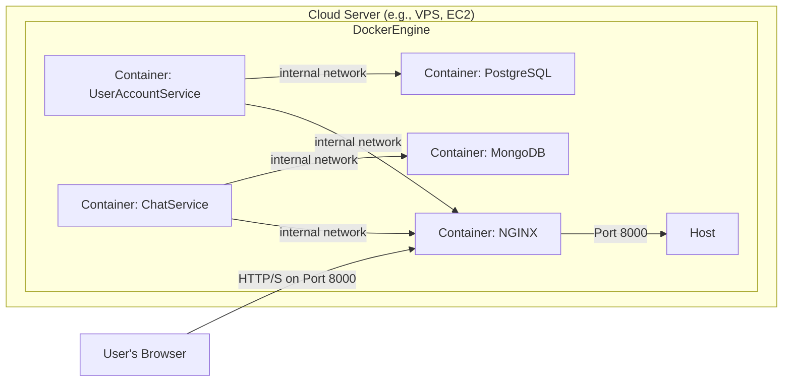

# Chat System - Project Documentation

## 1. Project Overview & Goal
This project is a real-time, web-based chat application designed to provide a seamless and interactive communication experience. The primary goal is to create a robust, scalable, and maintainable chat system using a modern microservices architecture.

The system allows users to register, find other users, manage friendships, and engage in private, real-time conversations. It leverages technologies like ASP.NET Core for the backend, SignalR for real-time communication, and a decoupled frontend, making it a comprehensive example of modern web application development.

### Core Features
* **User Authentication:** Secure user registration and login using JWT with refresh tokens.
* **User Discovery:** Ability to search for other users within the system.
* **Friendship Management:** Users can send, accept, decline, and remove friends.
* **Real-time Notifications:** Instant notifications for friendship-related activities using SignalR.
* **Private Conversations:** Users can initiate and participate in one-on-one chats.
* **Real-time Messaging:** Instant message delivery and updates within a chat window, powered by SignalR.
* **Conversation History:** All messages are persisted and can be viewed at any time.

## 2. User Stories
The following user stories define the core functionalities from the perspective of an end-user.

* **As a new user, I want to** create an account so that I can access the chat system.
* **As a registered user, I want to** log in with my credentials so that I can start using the application.
* **As a logged-in user, I want to** search for other users by their name so that I can find people I know.
* **As a logged-in user, I want to** send a friend request to another user so that we can become friends.
* **As a user, I want to** receive a notification when someone sends me a friend request so that I can respond to it.
* **As a user, I want to** view my pending friend requests so that I can accept or decline them.
* **As a user, I want to** see a list of my friends so that I can start a conversation with them.
* **As a logged-in user, I want to** start a conversation with a friend so that we can chat.
* **As a participant in a conversation, I want to** send messages that are instantly visible to the other person.
* **As a participant in a conversation, I want to** view the entire message history of our chat.
* **As a logged-in user, I want to** log out of the application to secure my account.

## 3. Use Cases
A typical use case for a user interacting with the system:

1.  **User Registration:**
    * The user navigates to the application's landing page.
    * The user clicks the "Register" button.
    * The system presents a form for username, email, and password.
    * The user fills out the form and submits it.
    * The system validates the input, creates a new user account, and logs the user in.

2.  **Sending a Message:**
    * **Precondition:** The user is logged in and has at least one friend.
    * The user sees their friends list.
    * The user clicks on a friend's name to open a conversation.
    * The system loads the chat window, displaying previous messages if any.
    * The user types a message into the input box and presses "Send".
    * The system sends the message to the server, persists it, and pushes it in real-time to the other user in the conversation.
    * The message appears instantly in the chat windows of both users.

## 4. Software Architecture

### 4.1. Architectural Pattern: Microservices
This project is built using a **Microservices Architecture**. This pattern was chosen for several key reasons:

* **Separation of Concerns:** It allows for a clear division of responsibilities. The `UserAccountService` handles all identity, profile, and friendship logic, while the `ChatService` is solely responsible for conversations and messages. This makes the codebase easier to understand and manage.
* **Technology Heterogeneity:** Each service can use the database technology best suited for its needs. We use a relational **PostgreSQL** database for the structured data of user accounts and friendships, and a NoSQL **MongoDB** database for the flexible, high-volume data of chat messages.
* **Scalability:** Each service can be scaled independently. If the chat functionality experiences high traffic, we can scale up the `ChatService` containers without affecting the `UserAccountService`.
* **Resilience:** An issue in one service is less likely to bring down the entire application.
* **Maintainability:** Smaller, focused services are easier to maintain, test, and deploy independently.

### 4.2. Architectural Diagram

The following diagram illustrates the high-level architecture of the system.

```mermaid
graph TD
    subgraph Browser
        Frontend[Vanilla JS Frontend]
    end

    subgraph Server
        Nginx[NGINX Reverse Proxy]

        subgraph "User & Auth"
            UAS[UserAccountService<br/>(ASP.NET Core)]
            Postgres[(PostgreSQL DB<br/>Users, Friends)]
        end

        subgraph "Chatting"
            CS[ChatService<br/>(ASP.NET Core)]
            Mongo[(MongoDB<br/>Conversations, Messages)]
        end

        UAS -- "Manages Data" --> Postgres
        CS -- "Manages Data" --> Mongo
        Nginx -- "/api/useraccount" --> UAS
        Nginx -- "/api/chat" --> CS
        UAS -- "API Call to get user info" --> CS
    end

    Frontend -- "HTTP/HTTPS Requests" --> Nginx
    Frontend -- "WebSocket (SignalR)" --> UAS
    Frontend -- "WebSocket (SignalR)" --> CS
```

### 4.3. Database Design

* **UserAccountService (PostgreSQL):**
    * **Users:** Stores user profile information (ID, Name, Email, PasswordHash). This data is structured and relational, making it a perfect fit for SQL.
    * **Friendships:** Manages the relationships between users with a status (Pending, Accepted, Declined). Foreign keys ensure data integrity.
    * **RefreshTokens:** Stores refresh tokens associated with users for persistent login sessions.

* **ChatService (MongoDB):**
    * **conversations:** Stores metadata about a chat, including an array of participant IDs. It also embeds a copy of the *last message* sent, a denormalization strategy to optimize loading the conversation list without needing a separate query.
    * **messages:** Stores every message with its content, sender, and timestamp. This collection is designed for high-write, high-read scenarios, where the flexibility of a NoSQL document store excels.

## 5. Technology Stack

* **Backend:** ASP.NET Core 9, C#
* **Real-time Communication:** SignalR
* **Databases:**
    * PostgreSQL (for User Accounts)
    * MongoDB (for Chat Data)
* **Frontend:** HTML5, CSS3, Vanilla JavaScript
* **Containerization:** Docker, Docker Compose
* **Web Server / Reverse Proxy:** NGINX
* **Testing:** xUnit, Moq
* **CI/CD:** GitHub Actions

## 6. Setup and Deployment

### 6.1. Prerequisites
* [Docker](https://www.docker.com/products/docker-desktop/)
* [Docker Compose](https://docs.docker.com/compose/install/)

### 6.2. Environment Configuration
Before running the application, you need to create a `.env` file in the root directory of the project. This file will hold all the necessary configuration secrets.

Create a file named `.env` and populate it with the following content. **Replace the placeholder values with your own secrets.**

```env
# PostgreSQL Credentials
POSTGRES_DB=chat_system_db
POSTGRES_USER=admin
POSTGRES_PASSWORD=your_strong_password_here

# JWT Secret Key (must be long and random)
JWT_SECRET=your_super_secret_and_long_jwt_key_that_is_at_least_32_chars

# ASP.NET Core Environment
ASPNETCORE_ENVIRONMENT=Development
```

### 6.3. Running the Application
1.  Open a terminal in the root directory of the project.
2.  Run the following command to build and start all the services in the background:
    ```bash
    docker-compose up --build -d
    ```
3.  The application will be available at `http://localhost:8000`.

### 6.4. API Documentation (Swagger)
The backend services include Swagger for API documentation and testing.
* **UserAccountService API:** `http://localhost:8001/swagger`
* **ChatService API:** `http://localhost:8002/swagger`

### 6.5. Deployment Diagram
This diagram shows how the containerized services would be deployed on a single server.



## 7. Testing

### 7.1. Unit Tests
The project includes extensive unit test suites for both backend services, located in the `UserAccountService.Tests` and `ChatService.Tests` projects. These tests use **xUnit** as the testing framework and **Moq** for mocking dependencies, ensuring that controllers and services behave as expected in isolation.

To run the tests, you can execute the `dotnet test` command inside the solution directory or use the CI pipeline.

### 7.2. User Acceptance Testing (UAT) Scenarios
The following scenarios can be used to manually test the system from an end-user's perspective.

**Scenario 1: Successful Registration and Login**
1.  **Action:** Navigate to `http://localhost:8000`.
2.  **Expected:** The login/register page is displayed.
3.  **Action:** Enter a new username, email, and password. Click "Register".
4.  **Expected:** The user is redirected to the main application page. A "Welcome" message is shown. The user's friends list is empty.

**Scenario 2: Full Friendship and Chat Workflow**
* **Precondition:** Two users, UserA and UserB, are registered and logged in on separate browsers.
1.  **Action (UserA):** In the search bar, type UserB's name and click "Search".
2.  **Expected (UserA):** UserB appears in the search results with an "Add Friend" button.
3.  **Action (UserA):** Click "Add Friend".
4.  **Expected (UserA):** The button changes to "Pending Request".
5.  **Expected (UserB):** A real-time notification appears. The "Friend Requests" list now shows UserA with "Accept" and "Decline" buttons.
6.  **Action (UserB):** Click "Accept".
7.  **Expected (UserB):** UserA is removed from the requests list and now appears in the "Friends" list.
8.  **Expected (UserA):** UserB now appears in the "Friends" list.
9.  **Action (UserA):** Click on UserB in the friends list.
10. **Expected (UserA):** A chat window opens for UserB.
11. **Action (UserA):** Type "Hello!" and send the message.
12. **Expected (UserA & UserB):** The message "Hello!" appears instantly in the chat window for both users.

## 8. CI/CD Pipeline
The project uses **GitHub Actions** for Continuous Integration. The workflow is defined in `.github/workflows/ci.yml` and includes two main jobs:
* **Lint:** Checks if the .NET code is correctly formatted using `dotnet format`.
* **Test:** Builds the services and runs the complete unit test suites for both `UserAccountService` and `ChatService`.

These jobs run automatically on every push and pull request to the `master` and `dev` branches, ensuring code quality and correctness.

## 9. Future Improvements
* **Static Code Analysis:** Integrate a tool like **SonarCloud** into the CI pipeline to automatically detect bugs, vulnerabilities, and code smells.
* **Frontend Enhancements:** Rebuild the frontend using a modern framework like React, Vue, or Svelte for better state management and a more component-based architecture.
* **Group Chats:** Extend the `ChatService` to support conversations with more than two participants.
* **End-to-End Testing:** Implement an automated end-to-end testing suite using a framework like Cypress or Playwright to simulate user interactions in a real browser.